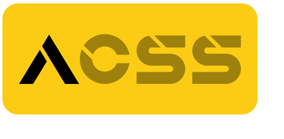
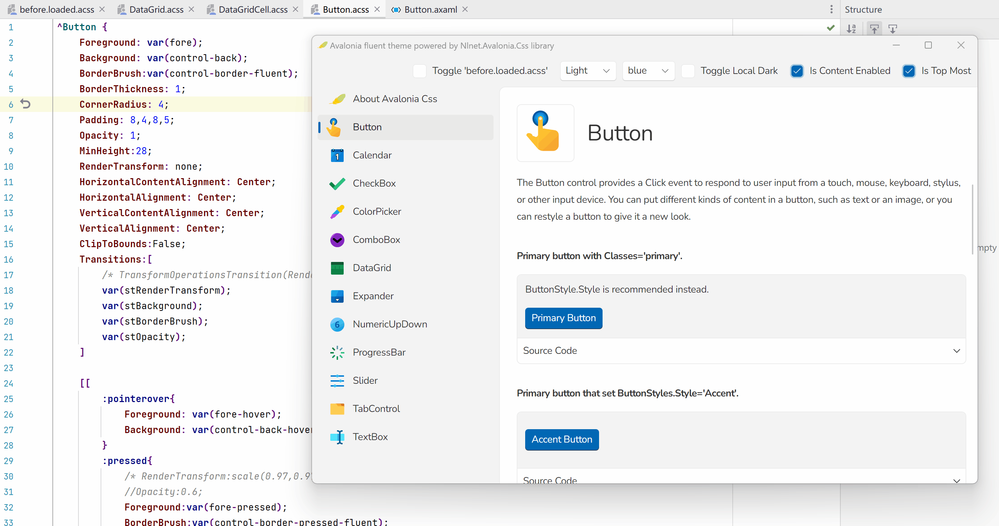

  
  
  
  
  
  

   

Avalonia.Css does not follow the standard CSS (Cascading Style Sheets). It is designed to **separate the structural and visual definitions** of Avalonia UI and empower the Avalonia with the ability to **dynamically modify visual styles quickly**. 

:smile: Yes, it follows a pattern similar to **Html+CSS**.

## Scenarios

Let's provide some examples to illustrate it.

🌰 Imagine we have a standard control library, where the functionality of its internal controls depends on the structure within their templates. If we want to modify the visual styles of the controls, we usually need to rewrite all ControlTheme. This means we have to rewrite control structure and visual styles, even resources. It's a painful process.

Then the idea of Acss was born :birthday:.

Picture this: By adopting the Acss pattern, we extract the visual styles from the standard themes of the controls, retaining only the skeletal structure, ControlTemplate. Any new visual library can be based on this standard themed structure, defining its own Acss library to achieve the desired visual styles. Creators of the visual library don't need to painfully copy existing ControlTheme code for modifications. They don't need to worry about whether the control structure is correct. They only thing they should concern is adjusting visual styles based on UI design!

> Theme = UI Structure + Visual Styles

🌰 Another case is when we create a new page, the traditional workflow usually involves layout, content population, writing business logic, style adjustments, and fine-tuning based on UI design. This is typically a developer's work, requiring continuous attention until the page is finished. Now, with the Acss pattern, the approach would involve functional personnel populating page content, writing business logic, and then handing it over to those who focus on visuals to harmonize the visual styles.

> Focusing separately on macro functions or visual details will make our work smoother, gentler and more comprehensive!

## Showcase

🌰 We provide fluent theme for Avalonia controls powered by Acss. More about the libraries we provided, see [Avalonia.Css.Fluent.md](doc/Nlnet.Avalonia.Css.Fluent/README.md).

<video src="D:\Source\Gitee\Avalonia.Css\img\nlnet.css.fluent.mp4"></video>

🌰 The Acss provides the ability of hot reloading. We can modify source code and view the result immediately.

## Packages

- **Nlnet.Avalonia.Css**. This is the core for Acss. See [here](doc/Nlnet.Avalonia.Css/README.md) for details.

- **Nlnet.Avalonia.Css.Controls**. This library provides pure structures for the controls of Avalonia.Controls. See [here](doc/Nlnet.Avalonia.Css.Controls/README.md) for details.

- **Nlnet.Avalonia.Css.Fluent**. This library provides Fluent UI for Avalonia.Controls ,Nlnet.Avalonia.Senior and Nlnet.Avalonia.MessageBox. See [here](doc/Nlnet.Avalonia.Css.Fluent/README.md) for details.

- **Nlnet.Avalonia.Css.Behaviors**. This library provides extended behaviors for Acss. See [here](doc/Nlnet.Avalonia.Css.Behaviors/README.md) for details.
- **Nlnet.Avalonia.Senior**. This library provides some extended features like **smooth scrolling** and other senior features that Avalonia.Controls can not provide. See [here](doc/Nlnet.Avalonia.Senior/README.md) for details.
- **Nlnet.Avalonia.MessageBox**. This provides a MessageBox control that can follow WPF standard or Avalonia standard. See [here](doc/Nlnet.Avalonia.MessageBox/README.md) for details.

## Features

### 🟢 Separation of Concerns

As mentioned above, Acss promotes the separation of structural and visual definitions of UI. Building upon the MVVM pattern, it further divides the view into structure and style.

### 🟢 Dynamic Changes

As an interpreted language where all style objects are created at runtime, Acss functions naturally supports dynamic changes to styles during runtime. We can easily switch global or local styles or collections of styles for an application.

> :fire: Importantly, it enables **hot reloading** of styles, allowing us to run the program, simultaneously write style code, and see real-time effects and feedback. No need for previews as we can see the results directly.

### 🟢 Intercept and Filter

Acss maps interpretive code to Avalonia style memory objects. During this mapping, we can intercept specified types of styles, properties, animations, resources, etc., and filter or replace them.

### 🟢 Behavioral Extensions

We provide a behavioral pattern that supports custom extensions, and it comes with built-in behaviors (Acss Behavior). Examples include "**esc to close window**", "**align the selected item to ComboBox**", **adding shortcuts,** **adding predefined animations,** etc. We will continue expanding and updating these built-in behaviors to enhance ease of use for Acss.

> Note that we haven't used the Avalonia.Xaml.Interactivity component. You can still independently use Acss Behavior and Avalonia.Xaml.Interactivity without worrying about any mutual impact or conflicts.

### 🟢 Custom Drawing

We will offer a built-in AcssBorder, which, while implementing the same functionality as Border, provides external drawing API and access to these API within the Acss syntax. This means we can perform some custom drawing within Acss code.

### 🟢 Syntax Extensions

Based on the aforementioned code and object mapping process, we can extend usage beyond standard Avalonia syntax. For instance, we can define Transition resources and use them directly in the Transitions property. While this falls under static resources, it greatly supports unified resource management needs.

### 🟢 Style Debugging and Rewriting

We will provide an Acss-related style debugger, showcasing the entire process from parsing, loading, applying, to detaching. You can clearly see all Acss style objects presented in the program and perform actions on them, including disabling, loading, etc.

> Additionally, we will provide rewriting functionality, generating change code for manually modified styles and offering the ability to write back to code files or specified output streams.

### 🟢 Security Concerns

Since Acss code files may be exposed in external static text files, potential security issues may arise. Please refer to the [Plans | Security](doc/Plans.md### Security) section for more details. If this issue is crucial to you, carefully decide whether to use Acss based on our instructions and your specific situation.

# Usage

Please see the section of [Packages](##Packages) for details.

## Contribution

We hope more interested partners could join us in enhancing and expanding Acss, making it more vibrant and capable.

If you're interested in getting involved or have any ideas, suggestions, or feedback, please send an email to yangqi1990917@163.com. In the email, you could tell us about:

- About you.
- What can we do for you?
- How would you like to get involved in this project?
- Something else you would like to say.

## Plans

Plans see [here](doc/Plans.md).
