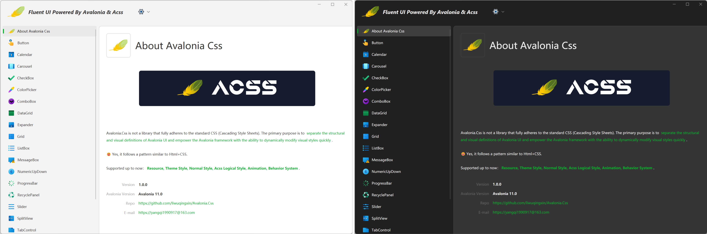

  
  
  
  

  

Avalonia Css,  or Acss for short, does not follow the standard CSS (Cascading Style Sheets). It is designed to **separate the structural and visual definitions** of Avalonia UI and empower the Avalonia with the ability to **dynamically modify styles quickly**. 

Yes, it follows a pattern similar to **Html+CSS**.

Many thanks to Jet Brains for [developer tools free of charge](https://www.jetbrains.com/community/opensource/?utm_campaign=opensource&utm_content=approved&utm_medium=email&utm_source=newsletter&utm_term=jblogo#support).

# Features

- Separation of Structure and Style
- Structure Reuse
- Dynamic Loading
- Hot Loading
- Intercept and Filter
- Behavioral Extensions
- Syntax Extensions
- Style Debugging
- Custom Drawing

# Documentation

The domain name used in the document is being filed and is temporarily unavailable for access. Please visit the temporary address of the document: https://yangqi1990917.gitbook.io/avalonia-css-document/.
中文请访问这里：https://yangqi1990917.gitbook.io/avalonia-css-documentation-1/documentation/readme。

~~Documentation is available [here](https://docs.en.avalonia.css.nlnet.net/documentation/readme).  Note that documentation for English is translated from Chinese by DeepL. If you have any problem with it, you are welcome to edit it in github.~~

> ~~中文文档请参考 [这里](https://docs.avalonia.css.nlnet.net/documentation/readme)。~~

# Usage

Please see [here](https://docs.en.avalonia.css.nlnet.net/documentation/zhu-ti-bang-zhu/ru-he-shi-yong-acss) for using Acss.

# Contribution

We hope more interested partners could join us in creating Acss, making it more vibrant and capable.

If you're interested in getting involved or have any ideas, suggestions, or feedback, please send an email to yangqi1990917@163.com.

# Showcase

We provide fluent theme for Avalonia controls powered by Acss. More about the theme please see [Acss.Fluent](https://docs.en.avalonia.css.nlnet.net/documentation/zhu-ti-bang-zhu/ru-he-shi-yong-acss.fluent).

See more about the acss showcase in [bilibili](https://space.bilibili.com/1117754194/channel/seriesdetail?sid=3739599) or [youtube](https://www.youtube.com/channel/UCYvEgvGj-JVYZrOrup3aoBQ).

 

# Why Using Acss

> Theme = Structure + Styles

Imagine we have a standard control library, where the functionality of its controls depends on the structure within their templates. If we want to modify the look of the controls, we usually need to rewrite all ControlTheme of them. This means we have to rewrite the control structure and the styles, even the resources. It's a painful work.

Picture that with the Acss pattern, we extract the styles from the standard themes of the controls, retaining only the skeletal structure, the ControlTemplate. Any library can base on the standard structures, defining its own Acss library to achieve the desired look for the controls. Creators of those libraries don't need to painfully copy existing ControlTheme code for modifications. They don't need to worry about whether the control template is correct. The only thing they should concern is adjusting styles based on UI design!

> Continuous focus makes our work smoother, more elegant, and more effective.

Another case is when we create a new page, the traditional workflow usually involves layout, content population, writing business logic, style adjustments, and fine-tuning based on UI design. This is typically a developer's work, requiring continuous attention until the page is finished. Now, with the Acss pattern, the approach would involve functional personnel populating page content, writing business logic, and then handing it over to those who focus on visuals to harmonize the visual styles.

# Packages We Provided

- **Nlnet.Avalonia.Css**. This is the core for Acss.

- **Nlnet.Avalonia.Css.Controls**. This library provides pure structures for the controls of Avalonia.Controls.

- **Nlnet.Avalonia.Css.Fluent**. This library provides Fluent UI for Avalonia.Controls ,Nlnet.Avalonia.Senior and Nlnet.Avalonia.MessageBox.

- **Nlnet.Avalonia.Css.Behaviors**. This library provides extended behaviors for Acss.
- **Nlnet.Avalonia.Senior**. This library provides some extended features like **smooth scrolling** and other senior features that Avalonia.Controls can not provide.
- **Nlnet.Avalonia.MessageBox**. This provides a MessageBox control that can follow WPF standard or Avalonia standard.
