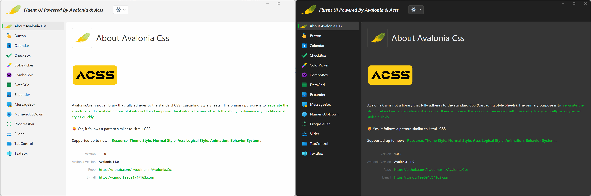

# Nlnet.Avalonia.Css.Fluent

This library provides Fluent UI for Avalonia.Controls ,Nlnet.Avalonia.Senior and Nlnet.Avalonia.MessageBox.



## Usage

Use the AcssFluentTheme in App's Styles.

```xaml
<Application x:Class="Nlnet.Avalonia.Css.Samples.App"
             xmlns="https://github.com/avaloniaui"
             xmlns:x="http://schemas.microsoft.com/winfx/2006/xaml"
             xmlns:nlnet="https://www.nlnet.com/avalonia"
             RequestedThemeVariant="Default">

    <Application.Styles>
        <!-- 
		We have not finished all controls in AcssFluentTheme. Use this for supplement.
		-->
        <FluentTheme />
        
        <nlnet:AcssFluentTheme />
    </Application.Styles>

</Application>