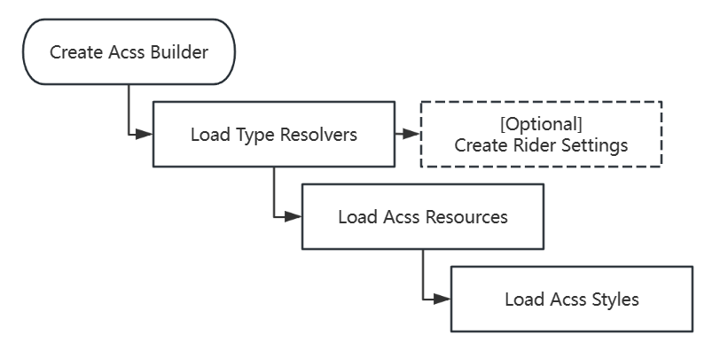

See [here](https://github.com/liwuqingxin/Avalonia.Css) for Acss.

# Nlnet.Avalonia.Css

This is the core of Acss. It provides the abilities to load Acss files, create avalonia styles and manage the lifecycle of them.

## Core Process

The Acss follows the process in the image below. 

1. You could create your own AcssBuilder object or use default static AcssBuilder object. Every AcssBuilder object works in their own scope without interaction. 

2. After creating the builder, all type resolvers should be loaded. If custom resource types should be used, also load them in this period. The following step like creating rider settings will be affected by the resolvers. All types mapped will become keyword for rider settings.

3. All resources should be loaded before any styles. Also it is important that the resources those are dependency of other resources should be loaded first.
4. Then styles could be loaded.

> :warning: WARNING 
>
> The best practice is managing your *.acss files in your own private folders to avoid interfering with other libraries.
>
> For example, if you load *.acss files by LoadFolder method, you may load unexpected files that mixed in the folder. DO NOT DO THIS!



## Editor

- For rider users, build the rider settings file with code below. We do not provide rider plugin to support Acss language till now. Use this for a temporary replacement. After settings file created, you should restart the rider to apply the settings.

```csharp
AcssBuilder.Default.TryBuildRiderSettingsForAcss(out _, out _, null);
```

> Note that the rider settings is related to the AcssBuilder object. It means for different builder objects, the settings will be different.

- Alternatively you can use Visual Studio Code as Acss editor with the extension '[avalonia-css-extension](https://marketplace.visualstudio.com/items?itemName=nlnet.avalonia-css-extension)', which is also a shabby version now.

## Usage

- Installation.

```bash
dotnet add package Nlnet.Avalonia.Css --version 1.0.0.0
```

- Use default Acss builder in Avalonia's AppBuilder. Then load all types. Alternatively, you can create your own Acss builder instead.

```csharp
private static AppBuilder BuildAvaloniaApp()
{
    return AppBuilder.Configure<App>()
        .UsePlatformDetect()
        ...
        
        // Use default avalonia css builder.
        .UseAcssDefaultBuilder()
        
        // Type resolver for 'Your.Lib'. The GenericTypeResolver<T> will load all types 
        // those belong to the assembly who contains the T class.
        .WithTypeResolverForAcssDefaultBuilder(new GenericTypeResolver<Icon>())
}
```

- Initialize the builder. In this section, you can setup the configuration like theme, create rider settings and load Acss files.  

```csharp
private class void Initialize()
{
    ...
	
    // [Optional] Set the current theme.
    AcssBuilder.Default.Configuration.Theme = "blue";
    
    // [Optional] Create rider settings for this Acss builder.
    AcssBuilder.Default.TryBuildRiderSettingsForAcss(out _, out _, null);
    
    // Load acss files. You can keep the cssFile for more operations.
    var loader = AcssBuilder.Default.BuildLoader();
	var cssFile = loader.Load(Application.Current.Styles, "Acss/app.acss");
    
    // Or load acss files from a folder.
    loader.LoadFolder(this, "Acss/");
    
    ...
}
```

>  More detail about using of Acss, see the code of [Nlnet.Avalonia.Css.App](../src/Nlnet.Avalonia.Css.App) or [Nlnet.Avalonia.Css.Fluent](../src/Nlnet.Avalonia.Css.Fluent).