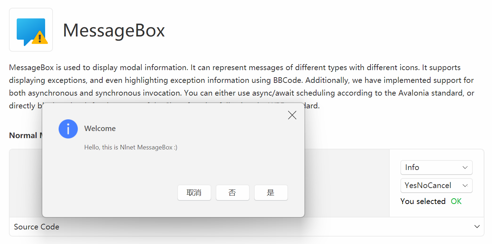

# Nlnet.Avalonia.MessageBox

This provides a MessageBox control that can follow WPF standard or Avalonia standard.



## Usage

- Installation.

```bash
dotnet add package Nlnet.Avalonia.MessageBox --version 1.0.0.0
```

- Show MessageBox in behind code.

```csharp
// WPF Standard: call messagebox synchronous.
private void BtnShowMessageBox_OnClick(object? sender, RoutedEventArgs e)
{
    var buttons = (Buttons)CbxButtons.SelectionBoxItem!;
    var image = (Images)CbxImage.SelectionBoxItem!;
    var result = MessageBox.Show("Hello, this is Nlnet MessageBox :)", "Welcome", buttons, image);
    
    TbxSelectedButton.Text = result.ToString();
}

// Avalonia Standard: call messagebox asynchronous.
private async void BtnShowMessageBoxAsync_OnClick(object? sender, RoutedEventArgs e)
{
    var buttons = (Buttons)CbxButtons.SelectionBoxItem!;
    var image   = (Images)CbxImage.SelectionBoxItem!;
    var result  = await MessageBox.ShowAsync("Hello, this is Nlnet MessageBox :)", "Welcome", buttons, image);
    
    TbxSelectedButton.Text = result.ToString();
}
```

